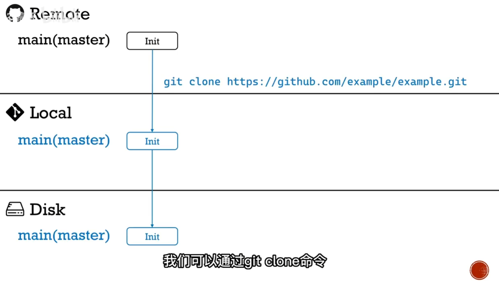

# 多分支
借助多分支实现多人同时开发不同的功能。
多分支的操作有很多，都记下来很麻烦，所以最好学习一个比较好的流程：
参考资料：
1. https://www.bilibili.com/video/BV19e4y1q7JJ/
2. 《Github入门与实践》（[日]大塚弘记）
## 多人开发流程
假设现在github上有一个仓库(Remote)，有一个团队想同时开发这个项目，我是其中一个。假设我要为这个项目添加一个功能A(feature-A)。

注意：本文的这套流程只适合团队开发，不适合开源的项目。项目的管理者需要再项目Settings的Collaborators给予团队成员权限（来创建分支）
而开源的项目，需要fork原仓库，在fork的仓库里进行操作，再PR，等待原仓库管理者同意合并。（可能会有《git使用实例3：fork-贡献开源项目》）

### 1.clone仓库、创建分支（编写代码）、提交分支

首先，用`git clone`复制到本地(Local)。

然后，创建一个分支，在这个分支上创建或修改代码：
`git checkout -b feature-A`

接下来，我就开始添加或修改代码了。
修改完成后，使用`git diff` 查看我做的更改。确认没问题后，用`git add <changed_file>`，将修改的文件添加到暂存区。
然后使用`git commit -m "更改的说明"` 提交更改。


本地的分支做好了后，就推送到远程仓库（Github）上：
`git push origin feature-A`

### （可选）添加功能时，项目出现变化，需要更新main分支
在我进行修改，添加功能时，项目可能发生了一些变化（其它成员做了改动），因此我要更新`main`分支:
切换到main分支然后pull远程仓库：
`git checkout main`
`git pull origin main`

并在`feature-A`分支同步改动后的main

`git checkout feature-A`
`git rebase main`
（rebase可能会出现confict，需要手动解决冲突。）
然后再将我的功能分支push到远程：
`git push -f origin feature-A`

## 请求合并
接下来，需要项目的管理者将我的分支(feature-A)合并到主分支(main)中。
在Github的项目页中，切换到feature-A分支，然后查看更改，确认后点击`Create Pull Request`(PR)，请求项目的管理者进行合并。
项目的管理者看到后，如果同意合并，就点击`Squash and merge`，将feature-A合并到main中。并点击`delete branch`删除该分支。

远程的分支删除后，也删除本地的`feature-A`（该分支的功能已经合并到main分支了）：
`git checkout main`
`git branch -D feature-A`
并将合并后的main分支pull下来：
`git pull origin main`


## 多分支常用命令
|功能|命令|
|-|-|
查看分支：|`git branch` 
创建分支| `git branch 分支名称`
切换分支|`git checkout 分支名称`
创建并切换分支|`git checkout -b 分支名称`
合并分支|`git merge 分支A`  
（先切换到分支A）推送到远程的分支A上|`git push -u origin 分支A`


推送分支到github(切换到分支D，并推送到远程仓库origin的D分支（如果没有，推送时会自动创建）)
```git 
git checkout -b feature-D
git push -u origin feature-D
```